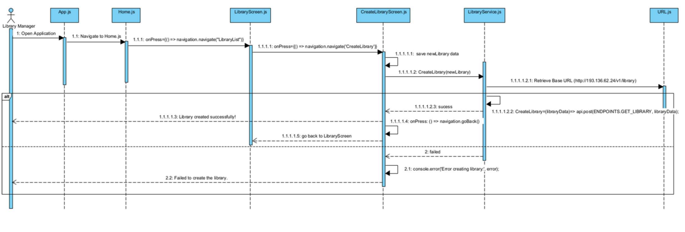
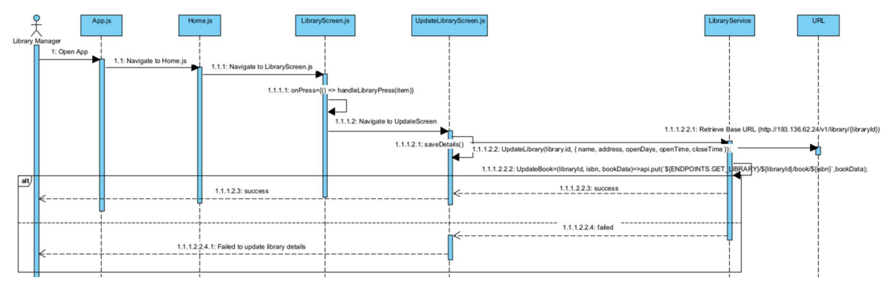
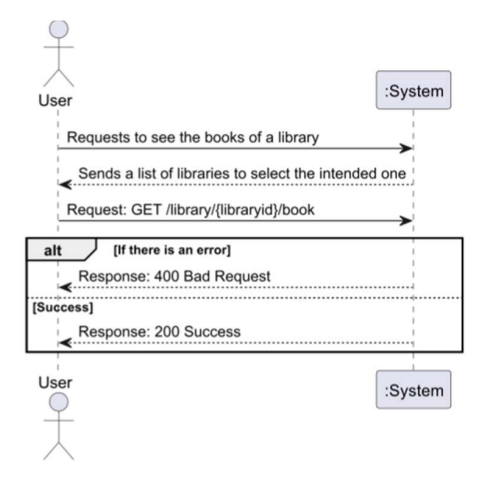
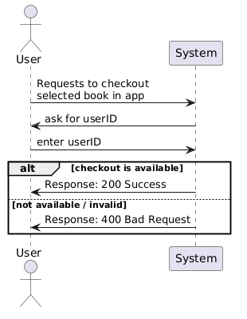
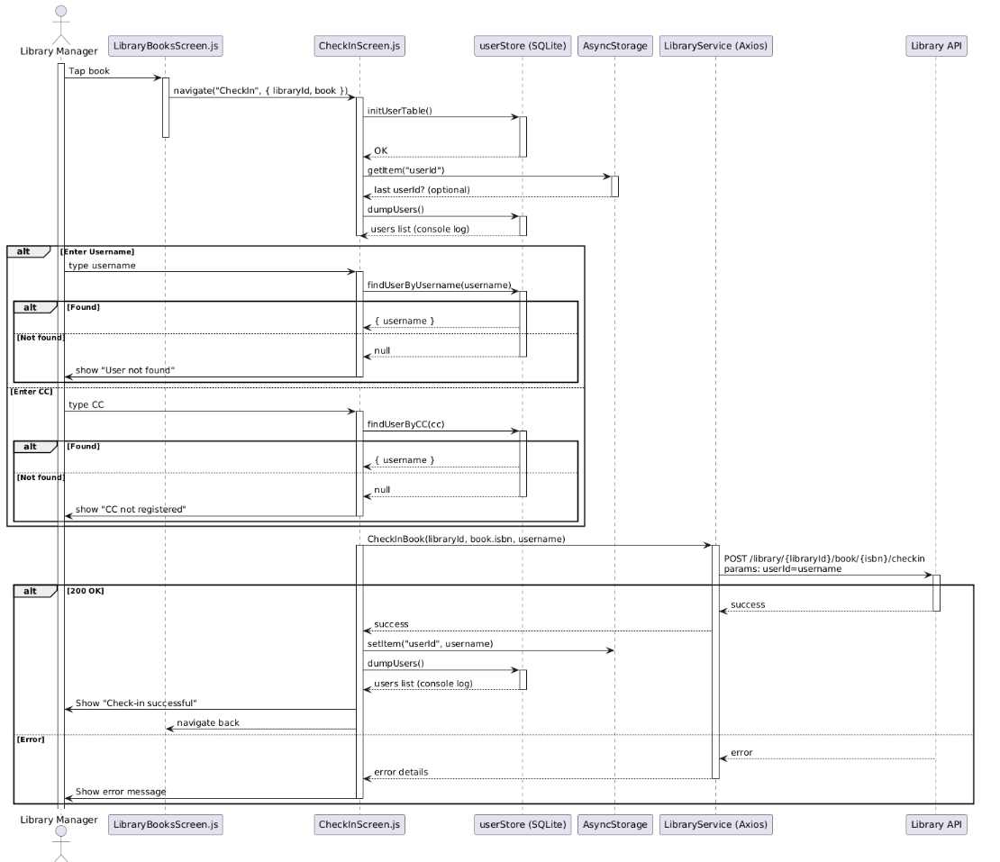

# 📑 Documentation

## UC1 — List Libraries

### Simple Sequence Diagram (SSD)

### Specification Table
| **Description**       | List all libraries available in the LibraryAPI |
|------------------------|-----------------------------------------------|
| **Pre-condition**      | The system must be connected to the internet/API |
| **Post-condition**     | A list of libraries is displayed to the user  |
| **Main flow**          | 1. The user requests the list of libraries   2. The API returns the list of libraries   3. The system displays the list to the user |
| **Alternative flow**   | No internet/API connection |

### Sequence Diagram (SD)

---

## UC2 — Create Library

### Simple Sequence Diagram (SSD)

### Specification Table
| **Description**       | Create a library in the LibraryAPI |
|------------------------|------------------------------------|
| **Pre-condition**      | The system must be connected to the internet/API |
| **Post-condition**     | Input fields are displayed and the user fills them with the information of the library to create |
| **Main flow**          | 1. The user requests to create a library   2. The system asks the user to insert the required information   3. The system creates the library in the API |
| **Alternative flow**   | Invalid data provided   The system returns an error |

### Sequence Diagram (SD)

---

## UC3 — Delete Library

### Simple Sequence Diagram (SSD)

### Specification Table
| **Description**       | Delete an existing library from the LibraryAPI |
|------------------------|-----------------------------------------------|
| **Pre-condition**      | The system must be connected to the internet/API and the library must exist |
| **Post-condition**     | The selected library is removed from the API and no longer displayed in the list |
| **Main flow**          | 1. The user selects a library from the list   2. The user chooses the **Delete** option   3. The system sends a delete request to the API   4. The API confirms the deletion   5. The system updates the list and shows a confirmation message |
| **Alternative flow**   | If the API request fails, the system shows an error message and the library remains in the list |

### Sequence Diagram (SD)

---

## UC4 — Update Library

### Simple Sequence Diagram (SSD)

### Specification Table
| **Description**       | Update an existing library in the LibraryAPI |
|------------------------|----------------------------------------------|
| **Pre-condition**      | The system must be connected to the internet/API and the library must exist |
| **Post-condition**     | The updated library information is saved in the API and shown in the list |
| **Main flow**          | 1. The user selects a library from the list   2. The user chooses the **Update** option   3. The system shows the current library details   4. The user edits the details (name, address, open days, open/close time)   5. The user saves changes   6. The system sends an update request to the API   7. The API confirms the update   8. The system navigates back and shows the updated list |
| **Alternative flow**   | Invalid or incomplete data → The system shows a validation error   API request fails → The system shows an error message and keeps the previous data |

### Sequence Diagram (SD)

---

## UC5 — Get Books from Selected Library

### Simple Sequence Diagram (SSD)

### Specification Table
| **Description**       | Retrieve and display all books from a selected library |
|------------------------|--------------------------------------------------------|
| **Pre-condition**      | The system must be connected to the internet/API and the library must exist |
| **Post-condition**     | A list of books from the selected library is displayed to the user |
| **Main flow**          | 1. The user selects a library from the list   2. The system navigates to the **LibraryBooksScreen** with the selected `libraryId`   3. The system calls `GetBooks(libraryId)` from the API   4. The API returns the list of books with their details (title, ISBN, pages, stock, availability, etc.)   5. The system displays the list of books in a **FlatList**, each rendered by `BookCard`   6. The user taps a book to open **BookModal** with available actions (Update, CheckOut, CheckIn) |
| **Alternative flow**   | If the API request fails → the system shows an error message   If no books are available → the system displays “No books found in this library.” |

### Sequence Diagram (SD)

---

## UC6 — Create/Add Book to Library

### Simple Sequence Diagram (SSD)

### Specification Table
| **Description**       | Add a new book to a selected library in the LibraryAPI |
|------------------------|--------------------------------------------------------|
| **Pre-condition**      | The system must be connected to the internet/API and the library must exist |
| **Post-condition**     | The selected book is registered in the library with the given stock and displayed in the list |
| **Main flow**          | 1. The user taps **Add New Book** in the `LibraryBooksScreen`   2. The system navigates to `LoadBookScreen` with the `libraryId`   3. The user enters an ISBN manually or scans it with the camera   4. The system calls `LoadBook(isbn)` to fetch book details from the API   5. If valid, book details (title, author, pages, cover, etc.) are displayed   6. The user taps **Add Book** → navigates to `AddBookScreen`   7. The user inputs a stock value and confirms   8. The system calls `AddNewBook(libraryId, isbn, { stock })`   9. The API registers the book and returns success   10. The system shows a confirmation message and updates the library’s book list |
| **Alternative flow**   | Invalid ISBN → the system shows an error message   ISBN already in library → the system prevents duplication   Invalid stock value → the system shows a validation error   API request fails → the system shows an error message and the book is not added |

### Sequence Diagram (SD)

---

## UC7 — Update Book (Stock) in Library

### Simple Sequence Diagram (SSD)

### Specification Table
| **Description**       | Update the stock of an existing book in a library |
|------------------------|---------------------------------------------------|
| **Pre-condition**      | The system must be connected to the internet/API, the library must exist, and the book must already belong to that library |
| **Post-condition**     | The book’s stock is updated in the API and displayed with the new value in the library’s book list |
| **Main flow**          | 1. The user selects a book in the `LibraryBooksScreen`   2. The system opens `BookModal` with available actions   3. The user taps **Update Book**   4. The system navigates to `UpdateBookScreen` with book details (title, ISBN, current stock, libraryId)   5. The screen initially shows details in read-only mode   6. The user taps the **Edit** icon and modifies the stock value   7. The user taps **Save**   8. The system calls `UpdateBook(libraryId, isbn, { stock })`   9. The API confirms success and updates the book record   10. The system shows a confirmation message and navigates back to `LibraryBooksScreen` where the updated stock is displayed |
| **Alternative flow**   | Invalid stock value → the system shows a validation error   API request fails → the system shows an error message and keeps the previous stock |

### Sequence Diagram (SD)

---

## UC8 — CheckOut Book in Library

### Simple Sequence Diagram (SSD)
  

### Specification Table
| **Description**       | Check out a book from a selected library to a user |
|------------------------|----------------------------------------------------|
| **Pre-condition**      | The system must be connected to the internet/API; the library and book must exist and have available copies |
| **Post-condition**     | A checkout record is created for the given user and the book’s availability is updated |
| **Main flow**          | 1. The user selects a book in `LibraryBooksScreen`   2. The system opens `BookModal` with actions   3. The user taps **CheckOut Book** (only enabled if `available > 0`)   4. The system navigates to `CheckOutScreen` with `libraryId` and `book.isbn`   5. The user resolves the checkout identity through one of three modes:   &nbsp;&nbsp;• **User ID** → searches by username   &nbsp;&nbsp;• **CC Lookup** → searches by citizen card   &nbsp;&nbsp;• **Create User** → enters CC, first name, phone, and role; reuses if CC exists or creates a new user if not   6. The user taps **Done**   7. The system calls `POST /v1/library/{id}/book/{isbn}/checkout?userId={userId}`   8. The API confirms success (returns checkout ID and due date)   9. The system stores the last `userId` in `AsyncStorage`, shows a receipt (Checkout ID, ISBN, Due Date), updates the local SQLite dump, and navigates back to `LibraryBooksScreen`   10. On return, the book list refreshes automatically |
| **Alternative flow**   | Missing/invalid input depending on mode → the system shows a validation error   No copies available → the system prevents checkout and shows an error   API request fails → the system shows an error message and no changes are made |

### Sequence Diagram (SD)
  

---

## UC9 — CheckIn Book in Library

### Simple Sequence Diagram (SSD)
  

### Specification Table
| **Description**       | Check in a book previously checked out from a library |
|------------------------|-------------------------------------------------------|
| **Pre-condition**      | The system must be connected to the internet/API; the library and book must exist and the book must be currently checked out |
| **Post-condition**     | The check-in is recorded in the API, the book’s availability is updated, and the last used `userId` is saved locally |
| **Main flow**          | 1. The user selects a book in `LibraryBooksScreen`   2. The system opens `BookModal` with actions   3. The user taps **CheckIn Book** (only enabled if `checkedOut > 0`)   4. The system navigates to `CheckInScreen` with `libraryId` and `book`   5. The user resolves the check-in identity through one of two modes:   &nbsp;&nbsp;• **User ID** → searches by username in SQLite   &nbsp;&nbsp;• **CC Lookup** → searches by citizen card in SQLite   6. The user taps **Done**   7. The system calls `POST /v1/library/{id}/book/{isbn}/checkin?userId={userId}`   8. The API confirms success   9. The system stores the last `userId` in `AsyncStorage`, updates the local SQLite dump, shows a success message, and navigates back to `LibraryBooksScreen`   10. On return, the book list refreshes automatically |
| **Alternative flow**   | Missing/invalid input depending on mode → the system shows a validation error   User not found in SQLite → the system shows an error   API request fails → the system shows an error message and no changes are made |

### Sequence Diagram (SD)
  
